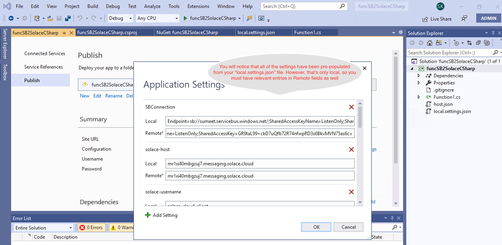

# azure2Solace
# Stream data from Azure Service Bus to Solace PubSub+ Event broker Using Azure Function

## What you'll learn: Overview

Often there is a requirement where architects and developer use messaging services like Azure Service Bus or Event Hub to move realtime data between apps running locally. However organizations need this realtime information flow across various regions, cloud and/or data centers. To accomplish that one needs an Event Mesh that provides hybrid cloud connectivity. 

Solace is an industry leader and its PubSub+ event brokers makes such an Event Mesh a reality.

This codelab specifically talks about how you can easily stream data from Azure messaging service "ServiceBus" to Solace using Azure function.

You will find the Azure function code [here](https://github.com/solacese/azure2Solace).

To learn how to stream data from Solace PubSub+ broker to Azure messaging services, click [here](https://docs.solace.com/Configuring-and-Managing/HTTP-Header-Authentication-Azure-Event-Hub.htm).

### High Level Architecture of this codelab's goal

### Prerequisites
* Access to Solace PubSub+ Event Broker
* Access to Azure Cloud environment

### Setup Instructions

#### Configure the Solace PubSub+ Event broker to receives messages on a queue 
In this example we will create two queues in Solace PubSub+, one of it will receive messages from Azure function over HTTP and another over C#.
Log on to Solace Console
1.	Create a queue that will receive data from Azure function using REST  
solace> enable 
solace# configure 
solace# (configure)# message-spool message-vpn <VPN Name>  
solace(configure/message-spool/message-vpn)# create queue azure-rest-queue 
solace(configure/message-vpn/my-azure-queue )# permission all consume  
solace(configure/message-vpn/my-azure-queue )# no shutdown 
solace(configure/message-vpn/my-azure-queue )# end 
########TODOO: Add topic subscription

2.	Create a queue that will receive data from Azure function using C# 
solace> enable 
solace# configure 
solace# (configure)# message-spool message-vpn <VPN Name>  
solace(configure/message-spool/message-vpn)# create queue **azure-c#-queue** 
solace(configure/message-vpn/my-azure-queue )# permission all consume  
solace(configure/message-vpn/my-azure-queue )# no shutdown 
solace(configure/message-vpn/my-azure-queue )# end 
########TODOO: Add topic subscription
Take a note of your Solace Event broker IP address and port no.

#### Azure Function Setup

* Create a new Azure function project in Visual Studio 
  
  Select **Azure Functions** from the list and click **Next**

* Configure your new project
  

* Create a new Azure Function application

In the above screen you will do the following:
  * Select **Azure Service Bus Trigger** from the list
  * Specifiy **Storage Account**
  * Specify **Connection String Setting Name**. This is the name that we will use in the Azure function code later.
  * Specify Service Bus **Queue Name**. This is the queue that we will stream data from to Solace Event broker.
  * Click **Next** to finish create a project.
  
* Open the local.settings.json file and add the following properties as shown in the picture below:
  

* Using NuGet package manager, search and install Solace library.
  

* Add the following code to **function1.cs** class.

  

`
using System;
using Microsoft.Azure.WebJobs;
using Microsoft.Azure.WebJobs.Host;
using Microsoft.Extensions.Logging;
using SolaceSystems.Solclient.Messaging;
using System.Threading;
using System.Text;
`
Copy the following code and paste it in your Function1.cs file.
``
namespace SB2SolaceCSharp
{

    public static class Function1
    {
       
        private static IContext context = null;
        
        private static IFlow flow = null;
        
        private static ISession session = null;
        
        private static ContextFactoryProperties cfp = new ContextFactoryProperties();
        
        private static string sUserName = Environment.GetEnvironmentVariable("solace-username");
        
        private static string sPassword = Environment.GetEnvironmentVariable("solace-password");
        
        private static string sVPNName = Environment.GetEnvironmentVariable("solace-vpnname");
        
        private static string sHost = Environment.GetEnvironmentVariable("solace-host");
        
        private static string sTopic = Environment.GetEnvironmentVariable("solace-topic");
        
        [FunctionName("Function1")]
        public static void Run([ServiceBusTrigger("testq", Connection = "SBConnection")]string myQueueItem, ILogger log)
        {
            connect();
            log.LogInformation($"C# ServiceBus queue trigger function processed message: {myQueueItem}");
            sendMessage2Solace(myQueueItem);
        }
        
        public static void connect()
        {
            if (session == null)
                connect2Solace();
        }
        
        public static void sendMessage2Solace(String msg)
        {
            IMessage message = ContextFactory.Instance.CreateMessage();
            message.Destination = ContextFactory.Instance.CreateTopic(sTopic);
            message.DeliveryMode = MessageDeliveryMode.Direct;
            message.BinaryAttachment = Encoding.ASCII.GetBytes(msg);
        
            Console.WriteLine("About to send message '{0}' to topic '{1}'", msg, sTopic);
            session.Send(message);
            message.Dispose();
            Console.WriteLine("Message sent. Exiting.");
        
        }
        
        public static void connect2Solace()
        {
            // Set log level.
            cfp.SolClientLogLevel = SolLogLevel.Warning;
            // Log errors to console.
            cfp.LogToConsoleError();
            // Must init the API before using any of its artifacts.
            ContextFactory.Instance.Init(cfp);
        
            ContextProperties contextProps = new ContextProperties();
            SessionProperties sessionProps = new SessionProperties();
        
            sessionProps.Host = sHost;
            sessionProps.UserName = sUserName;
            sessionProps.Password = sPassword;
            sessionProps.SSLValidateCertificate = false;
            sessionProps.VPNName = sVPNName;
        
            //Connection retry logic
            sessionProps.ConnectRetries = -1; //-1 means try to connect forever.
            sessionProps.ConnectTimeoutInMsecs = 10000; //10 seconds
            sessionProps.ReconnectRetries = -1; //-1 means try to reconnect forever.
            sessionProps.ReconnectRetriesWaitInMsecs = 5000; //wait for 5 seconds before retry
        
            // Compression is set as a number from 0-9, where 0 means "disable
            // compression", and 9 means max compression. The default is no
            // compression.
            // Selecting a non-zero compression level auto-selects the
            // compressed SMF port on the appliance, as long as no SMF port is
            // explicitly specified.
            sessionProps.CompressionLevel = 9;
        
            #region Create the Context
        
            context = ContextFactory.Instance.CreateContext(contextProps, null);
        
            #endregion
        
            #region Create and connect the Session
        
            session = context.CreateSession(sessionProps, null, null);
        
            session.Connect();
            Console.WriteLine("Connected to Solace >>>>>>>>>.");
        
            #endregion
        }
    }
}
`

*  Now Build your project.
*  Publish your Azure function as follows:

*  Now that your function is published, lets look at the Solace queue that will be receiving messages from servicebus.
