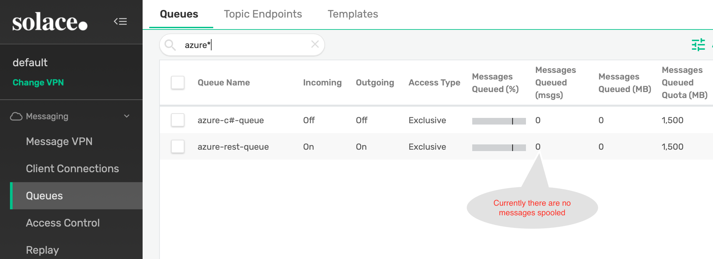

# Stream data from Azure Service Bus to Solace PubSub+ Event broker Using Azure Function

## What you'll learn: Overview

Often there is a requirement where architects and developer use messaging services like Azure Service Bus or Event Hub to move realtime data between apps running locally. However organizations need this realtime information flow across various regions, cloud and/or data centers. To accomplish that one needs an Event Mesh that provides hybrid cloud connectivity. 

Solace is an industry leader and its PubSub+ event brokers makes such an Event Mesh a reality.

This codelab specifically talks about how you can easily stream data from Azure messaging service "ServiceBus" to Solace using Azure function.

You will find the Azure function code [here](https://github.com/solacese/azure2Solace).

To learn how to stream data from Solace PubSub+ broker to Azure messaging services, click [here](https://docs.solace.com/Configuring-and-Managing/HTTP-Header-Authentication-Azure-Event-Hub.htm).

### High Level Architecture of this codelab's goal

### Prerequisites
* Access to Solace PubSub+ Event Broker
* Access to Azure Cloud environment

### Setup Instructions

#### Configure the Solace PubSub+ Event broker to receives messages on a queue 
In this example we will create two queues in Solace PubSub+, one of it will receive messages from Azure function over HTTP and another over C#.
Log on to Solace Console
1.	Create a queue that will receive data from Azure function using REST  
solace> enable 
solace# configure 
solace# (configure)# message-spool message-vpn <VPN Name>  
solace(configure/message-spool/message-vpn)# create queue **azure-rest-queue** 
solace(configure/message-vpn/my-azure-queue )# permission all consume  
solace(configure/message-vpn/my-azure-queue )# subscription topic azure/2/solace-rest 
solace(configure/message-vpn/my-azure-queue )# no shutdown 
solace(configure/message-vpn/my-azure-queue )# exit 

2. Create a queue that will receive data from Azure function using C# 
   solace(configure/message-spool/message-vpn)# create queue **azure-c#-queue** 
   solace(configure/message-vpn/my-azure-queue )# permission all consume  
   solace(configure/message-vpn/my-azure-queue )# subscription topic azure/2/solace 
   solace(configure/message-vpn/my-azure-queue )# no shutdown 
   solace(configure/message-vpn/my-azure-queue )# end 

#### Azure Function Setup (For C#/.Net APIs)

1. Create a new Azure function project in Visual Studio 
  
  Select **Azure Functions** from the list and click **Next**

2. Configure your new project
  

3. Create a new Azure Function application
  
   In the above screen you will do the following:
     * Select **Azure Service Bus Trigger** from the list
     * Specifiy **Storage Account**
     * Specify **Connection String Setting Name**. This is the name that we will use in the Azure function code later.
     * Specify Service Bus **Queue Name**. This is the queue that we will stream data from to Solace Event broker.
     * Click **Next** to finish create a project.
  
4. Open the **local.settings.json** file and add the following properties as shown in the code below:

   //Update the Service Bus end point connection string below  
   "SBConnection": "Endpoint=....windows.net/;SharedAccessKeyName=ListenOnly;SharedAccessKey=xxxxxxxxxxxxxxxxxxxxxxx", 
   //Update the Solace Host (SMF) URL string below 
   "solace-host": "mr1xi40mbgzuj7.messaging.solace.cloud", 
   //Update the Solace Username string below 
   "solace-username": "solace-cloud-client", 
   //Update the Solace Password string below 
   "solace-password": "abcgdjsjj", 
   //Update the Solace VPN Name string below 
   "solace-vpnname": "sumeet" 
   //Update the Solace Topic string below 
   "solace-topic": "azure/2/solace" 

5. Using NuGet package manager, search and install Solace library.
   

6. Create a new class called **SolacePublisher** and add the following code to **SolacePublisher.cs** class.

`
using System;

using SolaceSystems.Solclient.Messaging;

using System.Threading;

using System.Text;

namespace SB2SolaceCSharp
{

    public class SolacePublisher
    {

        private IContext context = null;
        private ISession session = null;
        private string sUserName = "default";
        private string sPassword = "default";
        private string sVPNName = "default";
        private string sHost = "default";
        private string sTopic = "default";

        //public Object lockThis = new Object();

        public SolacePublisher(string Host, string UserName, string Password, string VPNName, string Topic)
        {
            this.sHost = Host;
            this.sUserName = UserName;
            this.sPassword = Password;
            this.sVPNName = VPNName;
            this.sTopic = Topic;
            connect2Solace();
        }

        ~SolacePublisher()
        {
            Console.WriteLine("In destructor - Will try to dispose session and context");
            if (session != null)
            {
                session.Disconnect();
                session.Dispose();
                session = null;
                Console.WriteLine("In destructor - disposed session");
            }
            if (context != null)
            {
                context.Dispose();
                context = null;
                Console.WriteLine("In destructor - disposed context");
            }

        }

        public void sendMessage2Solace(String msg)
        {
            IMessage message = ContextFactory.Instance.CreateMessage();
            message.Destination = ContextFactory.Instance.CreateTopic(sTopic);
            message.DeliveryMode = MessageDeliveryMode.Direct;
            message.BinaryAttachment = Encoding.ASCII.GetBytes(msg);

            Console.WriteLine("About to send message '{0}' to topic '{1}'", msg, sTopic);
            session.Send(message);
            message.Dispose();
            Console.WriteLine("Message sent. Exiting.");

        }

        public void connect2Solace()
        {
            Console.WriteLine("In connect2Solace");
            ContextFactoryProperties cfp = new ContextFactoryProperties();

            // Set log level.
            cfp.SolClientLogLevel = SolLogLevel.Warning;
            // Log errors to console.
            cfp.LogToConsoleError();
            // Must init the API before using any of its artifacts.
            ContextFactory.Instance.Init(cfp);
            ContextProperties contextProps = new ContextProperties();
            SessionProperties sessionProps = new SessionProperties();

            /******** Delete This ***********/
            sHost = "54.219.47.90";
            sUserName = "default";
            sPassword = "default";
            sVPNName = "default";
            /********************************/
            sessionProps.Host = sHost;
            sessionProps.UserName = sUserName;
            sessionProps.Password = sPassword;
            sessionProps.SSLValidateCertificate = false;
            sessionProps.VPNName = sVPNName;

            //Connection retry logic
            sessionProps.ConnectRetries = 3; //-1 means try to connect forever.
            sessionProps.ConnectTimeoutInMsecs = 5000; //10 seconds
            sessionProps.ReconnectRetries = 3; //-1 means try to reconnect forever.
            sessionProps.ReconnectRetriesWaitInMsecs = 5000; //wait for 5 seconds before retry

            // Compression is set as a number from 0-9, where 0 means "disable
            // compression", and 9 means max compression. The default is no
            // compression.
            // Selecting a non-zero compression level auto-selects the
            // compressed SMF port on the appliance, as long as no SMF port is
            // explicitly specified.
            //sessionProps.CompressionLevel = 9;

            #region Create the Context

            context = ContextFactory.Instance.CreateContext(contextProps, null);

            #endregion

            #region Create and connect the Session
            session = context.CreateSession(sessionProps, null, null);
            session.Connect();
            #endregion
        }
    }
}
`

7. Add the following code to **function1.cs** class.

`
using System;

using Microsoft.Azure.WebJobs;

using Microsoft.Azure.WebJobs.Host;

using Microsoft.Extensions.Logging;

using SolaceSystems.Solclient.Messaging;

using System.Threading;

using System.Text;

namespace SB2SolaceCSharp
{

    public static class Function1
    {
    
        private static SolacePublisher solaceConnection = new SolacePublisher(
            Environment.GetEnvironmentVariable("solace-host"),
            Environment.GetEnvironmentVariable("solace-username"),
            Environment.GetEnvironmentVariable("solace-password"),
            Environment.GetEnvironmentVariable("solace-vpnname"),
            Environment.GetEnvironmentVariable("solace-topic"));

        [FunctionName("Function1")]
        public static void Run([ServiceBusTrigger("azure2solacecsharp", Connection = "SBConnection")]string myQueueItem, ILogger log)
        {
            log.LogInformation($">>>>>>>>>>>>>>>>>>>>>>>C# ServiceBus queue trigger function processed message: {myQueueItem}");
            solaceConnection.sendMessage2Solace(myQueueItem);
        }
    }
}
`

8. Now Build your project.
9. Publish your Azure function as follows:
   

   

   

   

   

   

   

10. Now that your function is published, logon to your Azure portal and start the function app.
   
   
11. Lets look at the Solace queue via Solace broker's WebUI that will be receiving messages from servicebus.
   

12. Send test messages to Service Bus Queue (on which you have configured the trigger to invoke above Azure function). Below is a screen grab of console output from my test application.
   

13. Refresh your Solace broker's WebUI to confirm you have received messages from ServiceBus.
   
